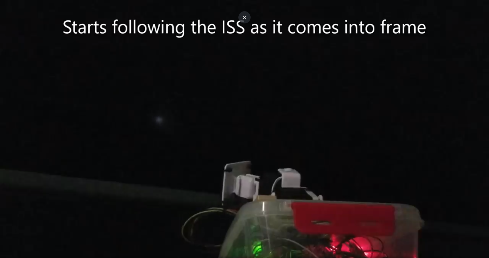
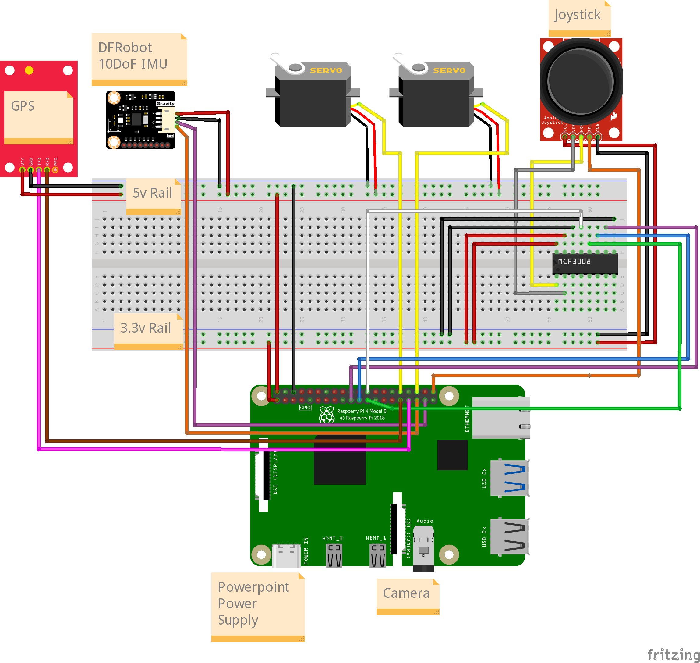
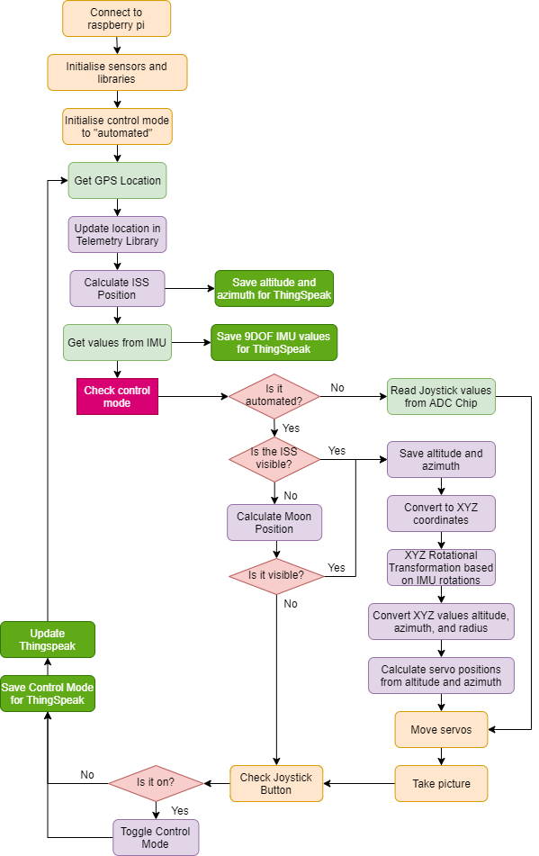
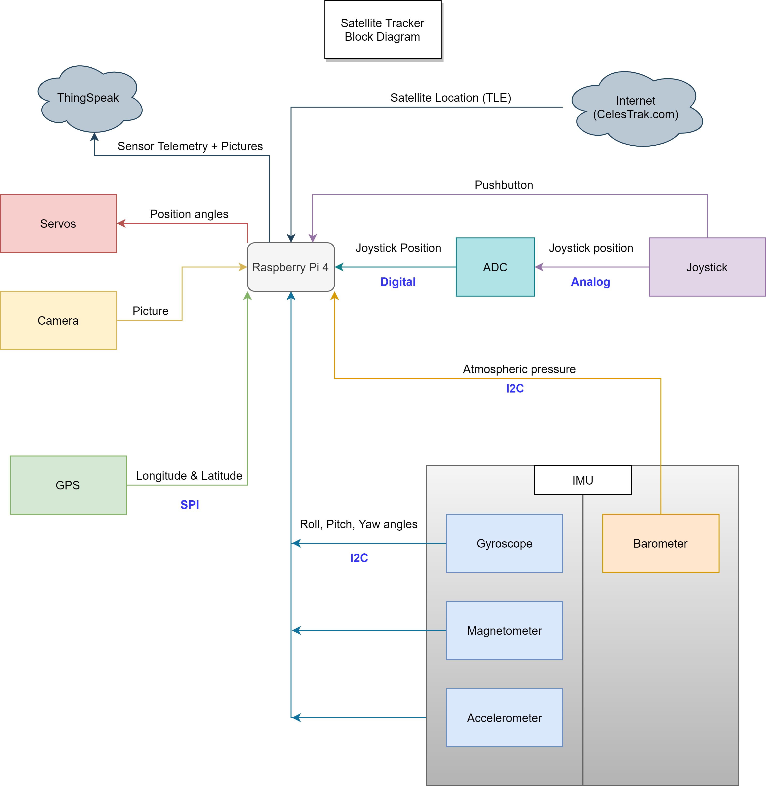

# SatelliteTracker
This project is designed to track and point toward satellites in the sky.
This was developed by Cameron Aume and Keith Andrews as their final project
for the Internet of Thing System Design (ENGG4201) Unit at Macquarie University.

# Project Components
 * Raspberry Pi Zero W
 * 2 EZ Robot Servo Motors
 * Pi Camera (not used with the current implementation)
 * Grove-GPS Sensor
 * DF Robot 10-DOF IMU
 * ADC MCP3008 Chip
 * 2-axis Analog Joystick

# Demo Video

# Circuit Diagram

# Program Flow Diagram

# Block Diagram

